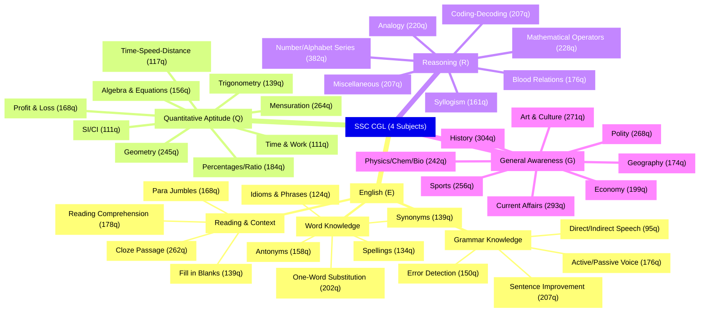
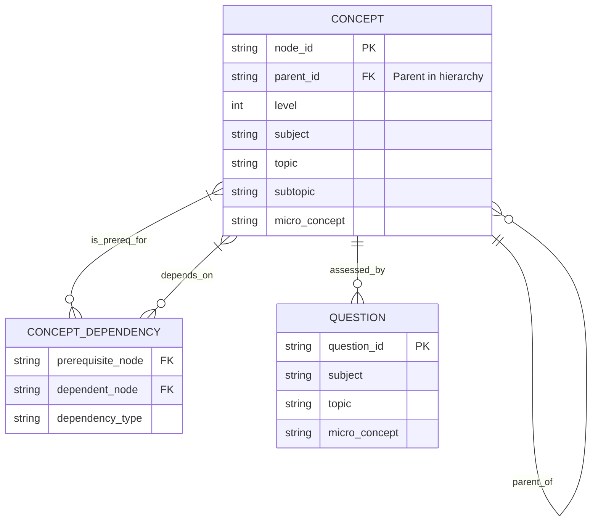
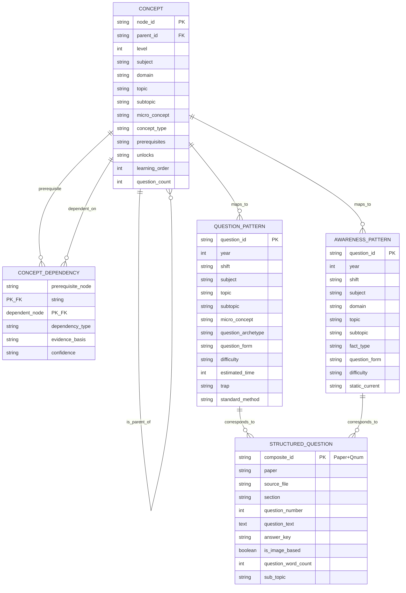

# SSC CGL PYQs - Mind Map & ER Diagram

This document contains the mind map visualization and entity-relationship diagram based on the SSC CGL PYQ analysis data.

## 1. Mind Map (High-Level Topic Structure)

## 2. ER Diagram (Data Model)

Shows relationships between Concepts (learning hierarchy), Dependencies (prerequisites), and Questions (pattern database).

## 3. Detailed ER Diagram (Full Schema)

Complete entity relationships across hierarchy, dependencies, pattern DBs, and structured questions.

# ER Diagram - Detailed Schema

## 4. Key Statistics

- Total Concepts (Nodes): 3276
- Total Dependencies (Edges): 3598
- Concepts by Subject: {'English': 359, 'GA': 1460, 'Quant': 1022, 'Reasoning': 435}
- Concepts by Level: {'0': 4, '1': 65, '2': 71, '3': 432, '4': 648, '5': 857, '6': 1199}

### Question Counts by Subject (from Pattern DBs)
- Quant: 2200 questions
- English: 2200 questions
- Reasoning: 2200 questions
- GA: 2200 questions
